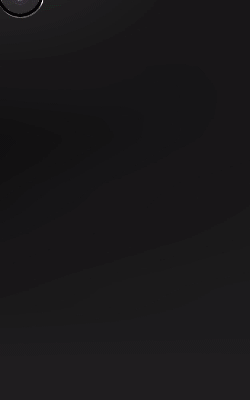
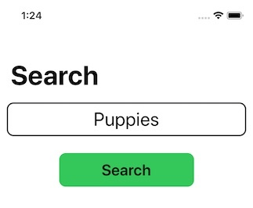

# PixabayCollections

Programmatic UICollectionView with Diffable Data Source

## Overview

This demo app uses the Pixabay image API to return images and metadata related to a search item provided by the user.

* The search term is entered on the app’s main screen (1)
* Results are shown in a collection view on a second screen (2) where the user can filter the list by tag using a search bar
* Tapping the "All Tags" button modally presents a view controller (3) that shows all the tags associated with images in the collection view
* Tapping on an image will show it in detail on a third page (4)
* Tapping the detail image modally presents a view showing all the image's available metadata (5)
* Long-pressing the image on the detail screen will present a menu (6) of options (save to photos lib, share and show metadata)


* The UI is created **100% programmatically** (there is no storyboard)
* The three main screens will be navigated using a **UINavigationController**
* Results will be displayed in **UICollectionView** with a **UICollectionViewDiffableDataSource**
* Images will be cached in an **NSCache**
* Results will be **paged** (20 items per page). When the user scrolls to the bottom of the collection view additional results will be requested

<p align="center">
  
</p>

___

## The Search View Controller

The search view controller is very simple: a **UITextField** and **UIButton**:



When the button's tapped an instance of the **ResultsViewController** is created and pushed onto the navigation controller's stack.

To keep configuration code out of the ResultsViewController we create **CustomTextField** and **CustomGoButton**:

``` swift
//
//  CustomTextField.swift
//  PixabayCollections
//
//  Created by Russell Archer on 02/05/2020.
//  Copyright © 2020 Russell Archer. All rights reserved.
//

import UIKit

class CustomTextField: UITextField {
    
    override init(frame: CGRect) {
        super.init(frame: frame)
        config()
    }
    
    convenience init(text: String) {
        self.init(frame: .zero)
        self.text = text
    }
    
    required init?(coder: NSCoder) {
        fatalError("init(coder:) has not been implemented")
    }
    
    private func config() {
        translatesAutoresizingMaskIntoConstraints = false
        layer.cornerRadius = 10
        layer.borderWidth = 2
        layer.borderColor = UIColor.systemGray4.cgColor
        
        textColor = .label
        tintColor = .label
        textAlignment = .center
        minimumFontSize = 12

        backgroundColor = .tertiarySystemBackground
        autocorrectionType = .no
        returnKeyType = .go
        clearButtonMode = .whileEditing
        placeholder = "Search text"
        
        // Support for dynamic type
        font = UIFont.preferredFont(forTextStyle: .title2)
        adjustsFontForContentSizeCategory = true
        adjustsFontSizeToFitWidth = true
    }
}

//
//  CustomGoButton.swift
//  PixabayCollections
//
//  Created by Russell Archer on 02/05/2020.
//  Copyright © 2020 Russell Archer. All rights reserved.
//

import UIKit

class CustomGoButton: UIButton {
    
    override init(frame: CGRect) {
        super.init(frame: frame)
        config()
    }
    
    required init?(coder: NSCoder) {
        fatalError("init(coder:) has not been implemented")
    }
    
    convenience init(title: String, backgroundColor: UIColor = UIColor.systemGreen) {
        self.init(frame: .zero)
        self.setTitle(title, for: .normal)
        self.backgroundColor = backgroundColor
    }
    
    private func config() {
        layer.cornerRadius = 10
        setTitleColor(.black, for: .normal)  
        translatesAutoresizingMaskIntoConstraints = false  // Turn constraints OFF as we'll be using auto layout
        
        // Support for dynamic type
        titleLabel?.font = UIFont.preferredFont(forTextStyle: .headline)
        titleLabel?.minimumScaleFactor = 0.5
        titleLabel?.adjustsFontSizeToFitWidth = true
        titleLabel?.adjustsFontForContentSizeCategory = true
    }
}
```

Here's code **SearchViewController**. Notice how we programmatically create constraints using `NSLayoutConstraint.activate`:

``` swift
//
//  SearchViewController.swift
//  PixabayCollections
//
//  Created by Russell Archer on 02/05/2020.
//  Copyright © 2020 Russell Archer. All rights reserved.
//

import UIKit

class SearchViewController: UIViewController {

    let searchTextField = CustomTextField(text: "Puppies")
    let goButton = CustomGoButton(title: "Search")
    
    override func viewDidLoad() {
        super.viewDidLoad()
        
        configViewController()
        configViews()
    }
    
    override func viewWillAppear(_ animated: Bool) {
        navigationController?.setNavigationBarHidden(false, animated: true)
    }
    
    private func configViewController() {
        view.backgroundColor = .systemBackground
        navigationController?.navigationBar.prefersLargeTitles = true
        title = "Search"
    }
    
    private func configViews() {
        configSearchTextField()
        configGoButton()
    }
    
    private func configSearchTextField() {
        view.addSubview(searchTextField)

        searchTextField.delegate = self
        searchTextField.translatesAutoresizingMaskIntoConstraints = false
        
        NSLayoutConstraint.activate([
            searchTextField.topAnchor.constraint(equalTo: view.safeAreaLayoutGuide.topAnchor, constant: UIConstants.padding),
            searchTextField.leadingAnchor.constraint(equalTo: view.leadingAnchor, constant: UIConstants.padding),
            searchTextField.trailingAnchor.constraint(equalTo: view.trailingAnchor, constant: -UIConstants.padding),
            searchTextField.heightAnchor.constraint(equalToConstant: 50)
        ])
    }
    
    private func configGoButton() {
        view.addSubview(goButton)
        goButton.addTarget(self, action: #selector(goButtonTapped), for: .touchUpInside)

        NSLayoutConstraint.activate([
            goButton.topAnchor.constraint(equalTo: searchTextField.bottomAnchor, constant: 25),
            goButton.centerXAnchor.constraint(equalTo: view.centerXAnchor),
            goButton.widthAnchor.constraint(equalToConstant: 200),
            goButton.heightAnchor.constraint(equalToConstant: 50)
        ])
    }
    
    @objc private func goButtonTapped() {
        showResults()
    }
    
    private func showResults() {
        guard let searchText = searchTextField.text, searchText.count > 2 else { return }
        
        let resultsVc = ResultsViewController()
        resultsVc.searchText = searchText
        navigationController?.pushViewController(resultsVc, animated: true)
    }
}

// MARK:- UITextFieldDelegate

extension SearchViewController: UITextFieldDelegate {
    func textFieldShouldReturn(_ textField: UITextField) -> Bool {
        // This method's called when the return key is tapped
        showResults()
        return true
    }
}
```
___

## Results View Controller

todo
