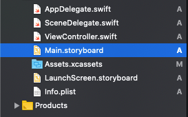
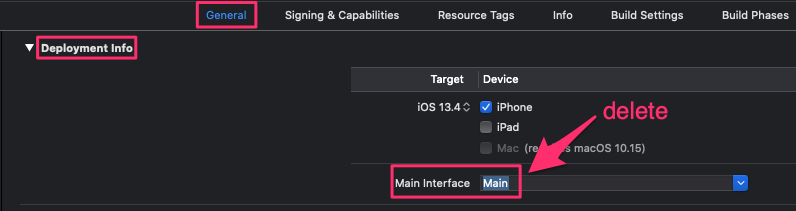
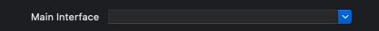
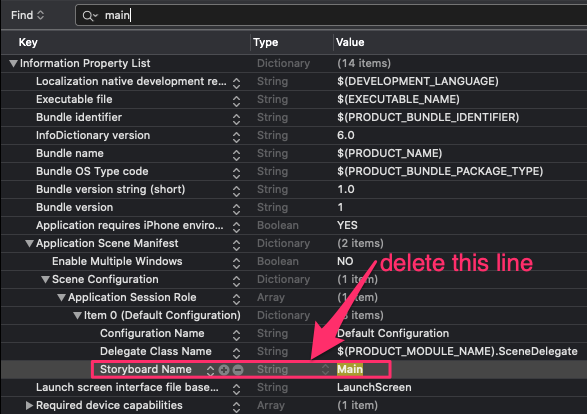
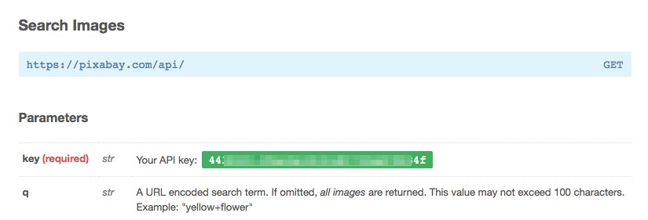
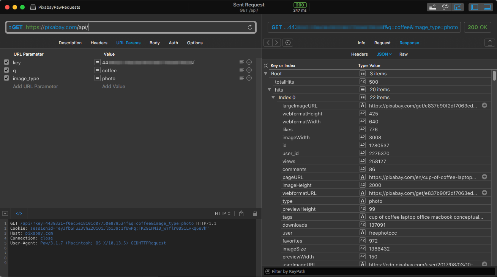
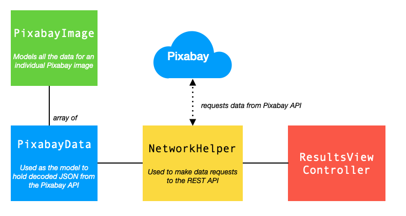
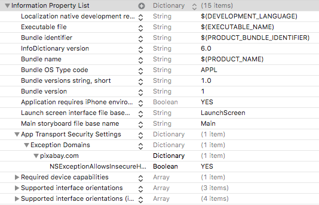
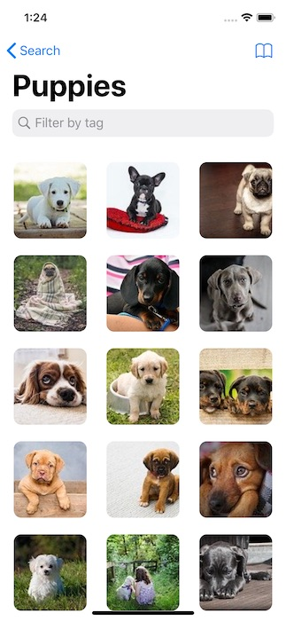

# PixabayCollections

Programmatic UICollectionView with Diffable Data Source

## Overview

This demo app uses the Pixabay image API to return images and metadata related to a search item provided by the user.

* The search term is entered on the app’s main screen (1)
* Results are shown in a collection view on a second screen (2) where the user can filter the list by tag using a search bar
* Tapping the "All Tags" button modally presents a view controller (3) that shows all the tags associated with images in the collection view
* Tapping on an image will show it in detail on a third page (4)
* Tapping the detail image modally presents a view showing all the image's available metadata (5)
* Long-pressing the image on the detail screen will present a menu (6) of options (save to photos lib, share and show metadata)


* The UI is created **100% programmatically** (there is no storyboard)
* No third-party frameworks are used
* The three main screens will be navigated using a `UINavigationController`
* Results will be displayed in `UICollectionView` with a `UICollectionViewDiffableDataSource`
* Images will be cached in an `NSCache`
* Results will be **paged** (20 items per page). When the user scrolls to the bottom of the collection view additional results will be requested

<p align="center">
  
</p>

___

## Creating an Xcode Project without a Storyboard

The project was created in Xcode using the *Single View App* template. 
Before we can begin with creating the UI programmatically we need to remove the storyboard and manually configure the app's window and 
initial view controller.

First, delete **Main.storyboard** and move it to the trash:



Delete the name of the storyboard in **Targets > General > Main Interface**:



So it looks like this:



Open **Info.plist**, search for **Main** and then remove the **Storyboard Name** entry entirely:



Finally, open **SceneDelegate.swift** and modify the `scene(_:willConnectTo:options:)` method as follows:

``` swift
class SceneDelegate: UIResponder, UIWindowSceneDelegate {

    var window: UIWindow?

    func scene(_ scene: UIScene, willConnectTo session: UISceneSession, options connectionOptions: UIScene.ConnectionOptions) {
        // Use this method to optionally configure and attach the UIWindow `window` to the provided UIWindowScene `scene`.
        // If using a storyboard, the `window` property will automatically be initialized and attached to the scene.
        
        guard let windowScene = (scene as? UIWindowScene) else { return }  // Get the window scene
        window = UIWindow(frame: windowScene.coordinateSpace.bounds)  // Create a window
        guard window != nil else { return }
        
        // Assign the window scene to the window's window scene
        window!.windowScene = windowScene
        
        // Set the root view controller (to the nav controller)
        window!.rootViewController = createNavController(with: createInitialViewControler())
        
        // Make the window visible
        window!.makeKeyAndVisible()
    }
    
    :
    :
```
___

## Search View Controller
`SearchViewController` is very simple: a `UITextField` and `UIButton`:


When the button's tapped an instance of the `ResultsViewController` is created and pushed onto the navigation controller's stack.

To keep configuration code out of the `ResultsViewController` we create `CustomTextField` and `CustomGoButton`:

``` swift
class CustomTextField: UITextField {
    :
    :
    
    private func config() {
        translatesAutoresizingMaskIntoConstraints = false
        layer.cornerRadius = 10
        layer.borderWidth = 2
        layer.borderColor = UIColor.systemGray4.cgColor
        
        textColor = .label
        tintColor = .label
        textAlignment = .center
        minimumFontSize = 12
        
        backgroundColor = .tertiarySystemBackground
        autocorrectionType = .no
        returnKeyType = .go
        clearButtonMode = .whileEditing
        placeholder = "Search text"
        
        // Support for dynamic type
        font = UIFont.preferredFont(forTextStyle: .title2)
        adjustsFontForContentSizeCategory = true
        adjustsFontSizeToFitWidth = true
    }
}

class CustomGoButton: UIButton {
    :
    :
    
    private func config() {
        layer.cornerRadius = 10
        setTitleColor(.black, for: .normal)  
        
        // Turn constraints OFF as we'll be using auto layout
        translatesAutoresizingMaskIntoConstraints = false  
        
        // Support for dynamic type
        titleLabel?.font = UIFont.preferredFont(forTextStyle: .headline)
        titleLabel?.minimumScaleFactor = 0.5
        titleLabel?.adjustsFontSizeToFitWidth = true
        titleLabel?.adjustsFontForContentSizeCategory = true
    }
}
```

Here's the code for `SearchViewController`. Notice how we programmatically create constraints using `NSLayoutConstraint.activate`:

``` swift
class SearchViewController: UIViewController {

    let searchTextField = CustomTextField(text: "Puppies")
    let goButton = CustomGoButton(title: "Search")
    
    :
    :
    
    private func configSearchTextField() {
        view.addSubview(searchTextField)
        
        searchTextField.delegate = self
        searchTextField.translatesAutoresizingMaskIntoConstraints = false
        
        NSLayoutConstraint.activate([
            searchTextField.topAnchor.constraint(equalTo: view.safeAreaLayoutGuide.topAnchor, constant: UIConstants.padding),
            searchTextField.leadingAnchor.constraint(equalTo: view.leadingAnchor, constant: UIConstants.padding),
            searchTextField.trailingAnchor.constraint(equalTo: view.trailingAnchor, constant: -UIConstants.padding),
            searchTextField.heightAnchor.constraint(equalToConstant: 50)
        ])
    }
    
    private func configGoButton() {
        view.addSubview(goButton)
        goButton.addTarget(self, action: #selector(goButtonTapped), for: .touchUpInside)
        
        NSLayoutConstraint.activate([
            goButton.topAnchor.constraint(equalTo: searchTextField.bottomAnchor, constant: 25),
            goButton.centerXAnchor.constraint(equalTo: view.centerXAnchor),
            goButton.widthAnchor.constraint(equalToConstant: 200),
            goButton.heightAnchor.constraint(equalToConstant: 50)
        ])
    }
  
    :
    :
}
```
___

## Pixabay API and our Data Model

Before reviewing the results view controller let's look at the Pixabay API and the data model we'll use.

The free Pixabay REST API allows us to seach for images. The response is a JSON encoded list of image URLs and metadata.

First, you need to register for an account at https://pixabay.com/en/accounts/register/.

Once you login to your account on Pixabay you’ll be able to see your API key in https://pixabay.com/api/docs/:



Queries are very simple. The main parameters are:

* **key**: Your API key
* **q**: What you’re searching for (URL encoded)
* **image_type**: The type of image you want ("all", "photo", "illustration", “vector")

For example, we can look for *coffee* photos (the **q** parameter must be URL encoded) with:

`https://pixabay.com/api/?key=your-api-key&q=coffee&image_type=photo`

Note that there are also **page** and **per_page** parameters which we can use to implement lazily-loaded paginated data.

We can test example queries in an HTTP client such as **Paw** (https://paw.cloud/), or simply in a browser:



Useful values returned in the response include:

* **totalHits**: The number of images accessible through the API. By default, the API is limited to return a maximum of 500 images per query
* **hits**: A collection of image metadata, including URLs for a preview image, large image, etc.

The `ResultsViewController` will use a `NetworkHelper` to make calls to the Pixabay API. 
JSON data returned from Pixabay will be decoded as a `PixabayData` struct:



The `PixabayData` struct:
* Implements the `Codable` protocol
* Is used as the model to map incoming raw JSON data from the Pixabay API
* The `hits` member of the struct will hold an array of image metadata (`PixabayImage`)

``` swift
struct PixabayData: Codable {
    let totalHits: Int
    let hits: [PixabayImage]
    let total: Int
}
```

The `PixabayImage` struct:
* Implements the `Codable` and `Hashable` protocols
* Models all the data for an individual Pixabay image

``` swift
struct PixabayImage: Codable, Hashable {
    let largeImageURL: String
    let tags: String
    let previewURL: String
    :
    :
}
```

The `NetworkHelper`:
* Is a struct that implements the `Singleton` pattern
* Provides a `loadImages(searchFor:page:completion:)` method to get a page of data from the Pixabay API (this doesn’t include actual image data, just URLs)
* Makes HTTP GET requests using a `URLSession dataTask`
* Decodes the incoming JSON data using `JSONDecoder`
* When data has been loaded calls the `completion` closure with a `PixabayData` struct
* Also provides a `loadImage(from:completion:)` method to load image data given a Pixabay image URL

Here's a snippet from the `loadImages(searchFor:page:completion:)` method. 
Note how the method has a `completion` parameter in the form of a closure that takes a `Result`:

```swift 
func loadImages(searchFor: String, page: Int = 1, completion: @escaping (Result<PixabayData?, NetworkHelperError>) -> Void) {
    :
    :
  
    let task = URLSession.shared.dataTask(with: url) { json, response, error in
    
        :
        :
            
        let decoder = JSONDecoder()
        decoder.keyDecodingStrategy = .convertFromSnakeCase
        
        // Attempt to decode the JSON as a PixabayData object
        let pixabayData = try? decoder.decode(PixabayData.self, from: json!)
        
        guard pixabayData != nil else {
            completion(.failure(.notDecodable))
            return
        }
        
        DispatchQueue.main.async { completion(.success(pixabayData!)) }
    }
        
  task.resume()
}
```

## iOS Security
The default security configuration for iOS will not allow requests to random URLs. 
You need to explicitly configure access to Pixabay by adding the following to your **Info.plist**:

``` xml 
<key>NSAppTransportSecurity</key>
<dict>
    <key>NSExceptionDomains</key>
    <dict>
        <key>pixabay.com</key>
        <dict>
            <key>NSExceptionAllowsInsecureHTTPLoads</key>
            <true/>
        </dict>
    </dict>
</dict>
```



Note that to avoid having hard-coded Pixabay constants (URL, etc.) we store them in a property list file named **Pixabay.plist**:

``` xml 
<?xml version="1.0" encoding="UTF-8"?>
<!DOCTYPE plist PUBLIC "-//Apple//DTD PLIST 1.0//EN" "http://www.apple.com/DTDs/PropertyList-1.0.dtd">
<plist version="1.0">
<dict>
     <key>scheme</key>
     <string>https</string>
     <key>host</key>
     <string>pixabay.com</string>
     <key>path</key>
     <string>/api</string>
     <key>key</key>
     <string>your-key-goes-here</string>
     <key>image_type</key>
     <string>photo</string>
</dict>
</plist>
```

A `PropertyFileHelper` allows the `NetworkHelper` to access Pixabay.plist:

``` swift
struct PropertyFileHelper {
    
    var hasLoadedProperties: Bool { return propertyFile != nil ? true : false }
    private var propertyFile: [String : AnyObject]?

    init(file: String) {
        propertyFile = readPropertyFile(filename: file)
    }
   
    /// Read a property from a dictionary of values that was read from a plist
    func readProperty(key: String) -> String? {
        guard propertyFile != nil else { return nil }
        guard let value = propertyFile![key] as? String else { return nil }
       
        return value
    }
   
    /// Read a plist property file and return a dictionary of values
    func readPropertyFile(filename: String) -> [String : AnyObject]? {
        guard let path = Bundle.main.path(forResource: filename, ofType: "plist") else { return nil }
        guard let contents = NSDictionary(contentsOfFile: path) as? [String : AnyObject] else { return nil }
        
        return contents
    }
}
```

___

## Results View Controller

`ResultsViewController` is the most complex view controller in the project. 



It has to handle:

* Getting **JSON** data from the Pixabay API (see below)
* Getting **preview images** from Pixabay and displaying them in a collection view
* Getting all the **tags** associated with all the preview images displayed
* **Filtering** images by tag. Changes to the collection view of images are controlled by a **diffable data source**
* **Paging** data. When the user has scrolled to the bottom of the collection view get another page of data and preview images

When the results view controller is loaded we setup the collection view and its data source as follows:

``` swift
func configCollectionView() {
    // Set the collectionView to fill our view
    collectionView = UICollectionView(
        frame: view.bounds, collectionViewLayout: CollectionViewHelper.createThreeColumnFlowLayout(in: view))

    view.addSubview(collectionView!)
    collectionView.delegate = self
    collectionView.backgroundColor = .systemBackground
    collectionView.register(PixabayImageCell.self, forCellWithReuseIdentifier: PixabayImageCell.reuseId)
}

func configureDataSource() {
    dataSource = UICollectionViewDiffableDataSource<CollectionViewSection, PixabayImage>(collectionView: collectionView) {
        collectionView, indexPath, data -> UICollectionViewCell? in
            
            let cell = collectionView.dequeueReusableCell(withReuseIdentifier: PixabayImageCell.reuseId, for: indexPath) as! PixabayImageCell
            // Setting the cell's previewImageUrl causes the preview image to be downloaded asynchronously from Pixabay
            cell.previewImageUrl = data.previewURL
            return cell
    }
}
```

We use a custom `UICollectionViewCell`-derived cell `PixabayImageCell`, which essentially contains a `UIImageView` and a `previewImageUrl` property.
When `previewImageUrl` is set we get `NetworkHelper` to asynchronously load the required image from Pixabay. 
When it’s loaded we set the `UIImageView.image` property. In this way all the preview images used in the collection view are loaded *without blocking the UI thread*:

``` swift
class PixabayImageCell: UICollectionViewCell {
    
    static let reuseId = "PixabayImageCell"

    var previewImageUrl: String = "" {
        didSet {
            guard !previewImageUrl.isEmpty else { return }           
            NetworkHelper.shared.loadImage(from: previewImageUrl) { image in
                guard let image = image else { return }
                self.imageView.image = image
            }
        }
    }
    
    private var imageView = UIImageView()

    :
    :
}
```

After the view controller has loaded we get the first page of data via `NetworkHelper`:

``` swift
private func getSearchResults() {
    :
    :
    
    NetworkHelper.shared.loadImages(searchFor: searchText!, page: page) { [weak self] result in
        :
        :

        switch result {
        case .failure(let error):
            :
            :
            return

        case .success(let data):
            :
            :
            if self.page == 1 {
                self.imageData = data!.hits
                self.totalImagesAvailable = data!.totalHits
            } else {
                self.imageData.append(contentsOf: data!.hits)
            }
            
            self.getAvailableTags()
            DispatchQueue.main.async { self.updateData() }
            return
        }
    }
}
```

Once the data has been successfully returned in and decoded `getSearchResults()` makes a call to `updateData()`. 
A snapshot of the data is created and changes applied to the data source. 
This results in multiple calls to the closure passed to `configureDataSource` so that each (visible) cell in the collectionView is updated.

``` swift
func updateData() {
    var snapshot = NSDiffableDataSourceSnapshot<CollectionViewSection, PixabayImage>()
    snapshot.appendSections([.main])
    snapshot.appendItems(imageDataIsFiltered ? imageDataFiltered : imageData)
    DispatchQueue.main.async {
        self.dataSource.apply(snapshot, animatingDifferences: true)
        :
        :
    }
}
```

___

## Detail View Controller

`DetailViewController` is fairly simple: 


All it has to handle is:

* Getting a full-size version of the selected preview image
* Creating a menu of options

When `ResultsViewController` sets the `pixabayImage` property in `DetailViewController` the full-size image is loaded asynchronously through `CustomImageView`:

``` swift
class DetailViewController: UIViewController {

    var pixabayImage: PixabayImage? {
        didSet {
            guard pixabayImage != nil else { return }
            spinner.startAnimating()
            loading = true
            imageView.imageUrl = pixabayImage!.largeImageURL  // imageLoadComplete(success:) called when image loaded
        }
    }
        
    private var imageView = CustomImageView(frame: .zero)
    :
    :
}
    
protocol CustomImageViewDelegate: class {
    func imageLoadComplete(success: Bool)
}

class CustomImageView: UIImageView {
        
    weak var delegate: CustomImageViewDelegate?
    
    var imageUrl: String? {
        didSet {
            guard let iu = imageUrl else { return }
            NetworkHelper.shared.loadImage(from: iu) { [weak self] img in
                guard let self = self else { return }
                guard let img = img else {
                    DispatchQueue.main.async { self.delegate?.imageLoadComplete(success: false) }
                    return
                }
                    
                self.image = img
                DispatchQueue.main.async { self.delegate?.imageLoadComplete(success: true) }
            }
        }
    }

    :
    :
}    
```


