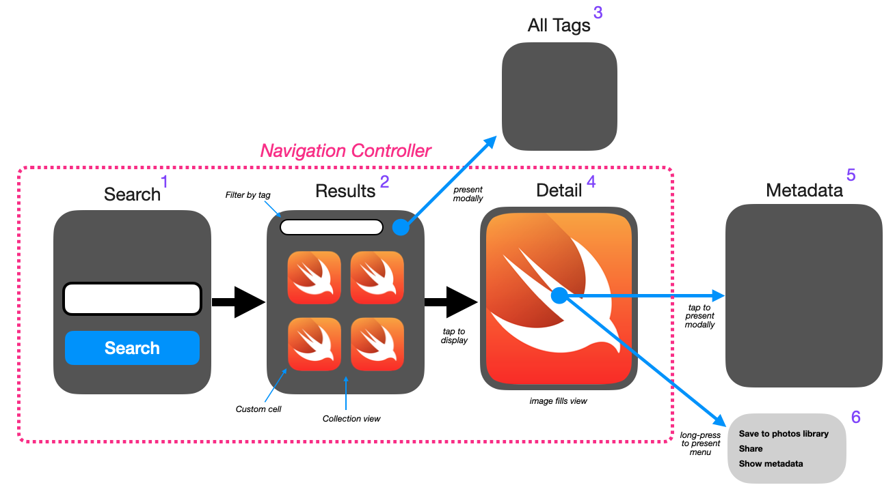

# PixabayCollections

Programmatic UICollectionView with Diffable Data Source

## Overview

This demo app uses the Pixabay image API to return metadata related to a search item provided by the user.

* The search term is entered on the app’s main screen
* Results are shown in a collection view on a second screen where the user can filter the list by tag using a search bar
* Tapping on an image will show it in detail on a third page
* Tapping the detail image modally presents a view showing all the image's available metadata
* Long-pressing the image on the detail screen will present a menu of options (save to photos lib, share and show metadata)

* The UI will be created programmatically (no storyboard)
* The three main screens will be navigated using a UINavigationController
* Results will be cached in an NSCache
* Results will be paged (25 items per page)
* Results will be displayed in UICollectionView with a UICollectionViewDiffableDataSource

___

## The Search View Controller

TODO
